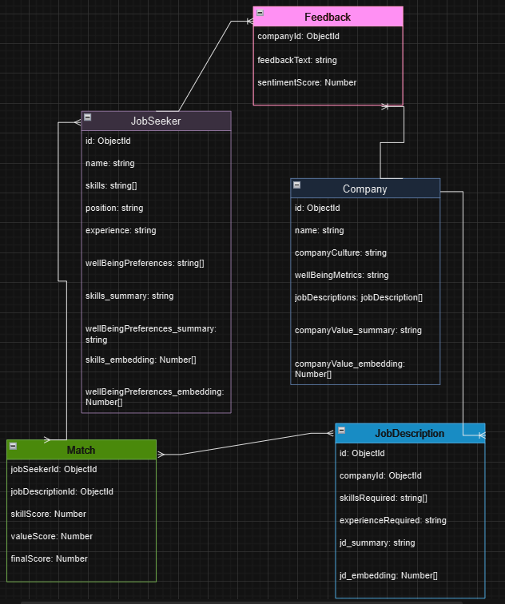

### 1. **Relevant Objects (Classes)**

**1.1 JobSeeker**

- **Purpose**: Represents the job seeker, including their skills, values, and preferences.
- **Attributes**:
  - `id`: Unique identifier for the job seeker. - "ObjectId"
  - `name`: Name of the job seeker. - "string"
  - `skills`: List of skills possessed by the job seeker. - "string[]"
  - `position`: Job position of the job seeker - "string"
  - `experience`: Summary or details of experience. - "string"
  - `wellBeingPreferences`: Preferences related to well-being. - "string[]"
  - `skills_summary`: Summary of skills, experience, and job position. (Of JobSeeker's name with id) - Generated by LLM model. - "string"
  - `wellBeingPreferences_summary`: Summary of well-being preferences. (Of JobSeeker's name with id) - Generated by LLM model. - "string"
  - `skills_embedding`: Vector representation of the job seeker’s skill for matching. (Embed the skills_summary) - Generated by embedding LLM model. - "Number[]"
  - `wellBeingPreferences_embedding`: Vector representation of the job seeker's well-being preference for matching. (Embed the well-being preference) - Generated by embedding LLM model. - "Number[]"
- **Behaviors**:
  - `createEmbedding()`: Generates vector embeddings for job seeker's skills and well-being preferences.
  - `updateProfile()`: Allows updates to skills, values, and experience. (Optional)
- **Validation Criteria**:
  - Skills should be validated against a predefined list.

**1.2 Company**

- **Purpose**: Represents a company, including its culture, well-being, and job description.
- **Attributes**:
  - `id`: Unique identifier for the company. - "ObjectId"
  - `name`: Company name. - "string"
  - `companyCulture`: Core values and cultural attributes. "string"
  - `wellBeingMetrics`: Indicators of the company’s support for well-being (e.g., mental health support), scrap and evaluate from the Internet. - "string"
  - `jobDescriptions`: List of active JDs. - "JobDescription[]"
  - `companyValue_summary`: Summary of company culture, well-being. - Generated by LLM model. - "string"
  - `companyValue_embedding`: Vector representation of the company's culture and well-being information for matching. (Embed the companyValue_summary). - Generated by embedding LLM model. - "Number[]"
- **Behaviors**:
  - `createEmbedding()`: Generates vector embeddings for company values and culture.
  - `addJobDescription(jd)`: Adds a new job descriptions to the company profile.
- **Validation Criteria**:
  - Values must be comprehensive and align with standard categories (e.g., collaboration, flexibility).
  - Well-being metrics should be validated with valid scales or categories.

**1.3 JobDescription**

- **Purpose**: Represents a job position within a company, including required skills and role-specific information.
- **Attributes**:
  - `id`: Unique identifier for the job position. - "ObjectId"
  - `companyId`: Identifier linking to the company. - "ObjectId"
  - `title`: Title of the job position. - "string"
  - `skillsRequired`: List of required skills for the position. - "string[]"
  - `experienceRequired`: Minimum experience level required. - "string"
  - `jd_summary`: Summary of company JD. Collected based on title, position, and experience. - Generated by LLM model. - "string"
  - `jd_embedding`: Vector representation of the company's JD information for matching. (Embed the JD_summary). - Generated by embedding LLM model. - "Number[]"
- **Behaviors**:
  - `createEmbedding()`: Generates vector embeddings for the job description.
- **Validation Criteria**:
  - Skills required should match a predefined list to maintain consistency.
  - Experience levels should be clearly defined in years or a standardized metric.

**1.4 Match**

- **Purpose**: Represents a potential match between a job seeker and a job opening (JD) based on skills and values compatibility.
- **Attributes**:
  - `jobSeekerId`: Identifier for the job seeker.
  - `jobDescriptionId`: Identifier for the job Description.
  - `skillScore`: Compatibility score based on skill match.
  - `valueScore`: Compatibility score based on values and well-being alignment.
  - `finalScore`: Weighted final score combining skills and values.
- **Behaviors**:
  - `calculateFinalScore(weightSkills, weightValues)`: Computes a weighted average of skill and values scores.
  - `displayMatchDetails()`: Formats match information for UI display with the final score > 50.
- **Validation Criteria**:
  - Skill and values scores should be an integer between 0-100.
  - Final score should be a weighted as the average of skill and values scores.

**1.5 Feedback**

- **Purpose**: Collects anonymous feedback from employees regarding the company culture and well-being support.
- **Attributes**:
  - `companyId`: Identifier linking feedback to the company.
  - `feedbackText`: Text of the feedback provided by the employee.
  - `sentimentScore`: Sentiment analysis score derived from feedback.
- **Behaviors**:
  - `analyzeSentiment()`: Runs NLP analysis to determine sentiment score.
  - `storeFeedback()`: Saves feedback to the database.
- **Validation Criteria**:
  - Feedback text should be non-empty and meet a minimum character count.
  - Sentiment score should be within an acceptable range (e.g., 1 to 5).

### 2. **Additional Notes for Implementation**

1. **Embedding Generation**: The `createEmbedding()` method in each relevant class should use LangChain's embedding model (e.g., GoogleGenerativeAIEmbeddings) to transform textual data (skills, values) into vectors that are stored in a vector database.
2. **Compatibility Scoring**: The `calculateFinalScore()` in the `Match` class should allow for dynamic weight adjustments. This will be essential for balancing skill vs. values alignment in the final compatibility score.
3. **Data Collection and Storage**: Ensure that any anonymous feedback collected from the `Feedback` class is appropriately anonymized and securely stored.
4. **Interface Design**: The `displayMatchDetails()` method in `Match` should prepare data in a user-friendly format for the UI, emphasizing compatibility scores to help users quickly gauge potential matches.
5. **Error Handling and Logging**: Implement comprehensive error handling, especially in methods that interact with external data (e.g., embedding APIs or sentiment analysis). Console logging and UI feedback will also improve the debugging and user experience.
